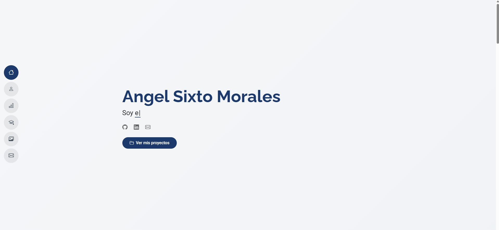
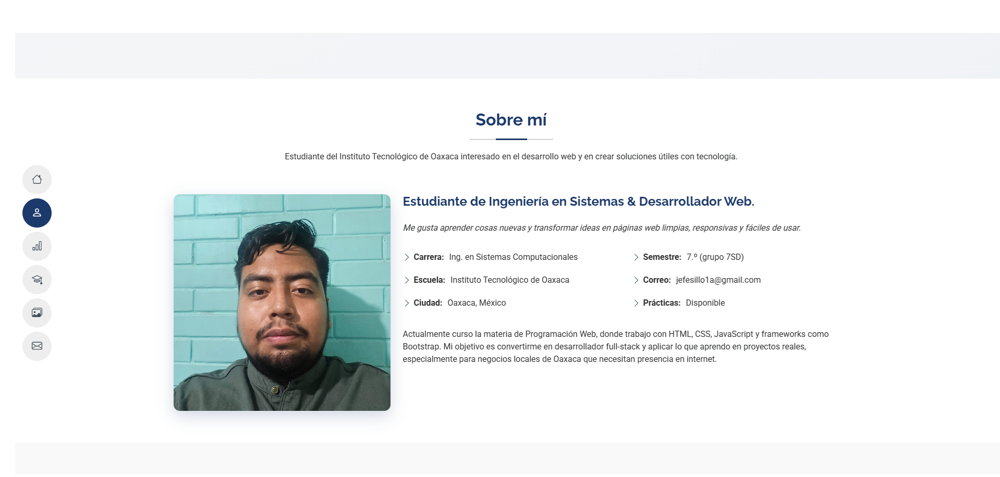
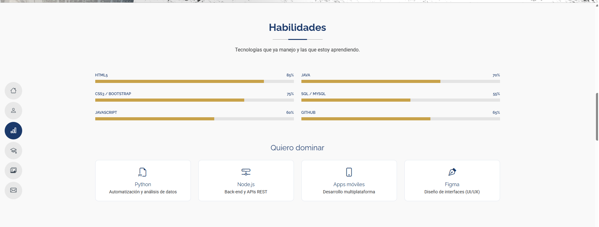
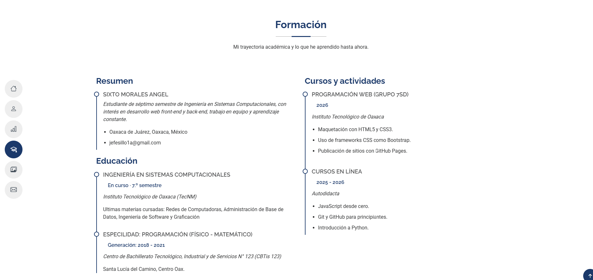
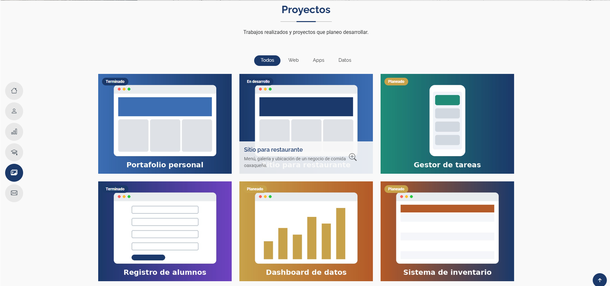
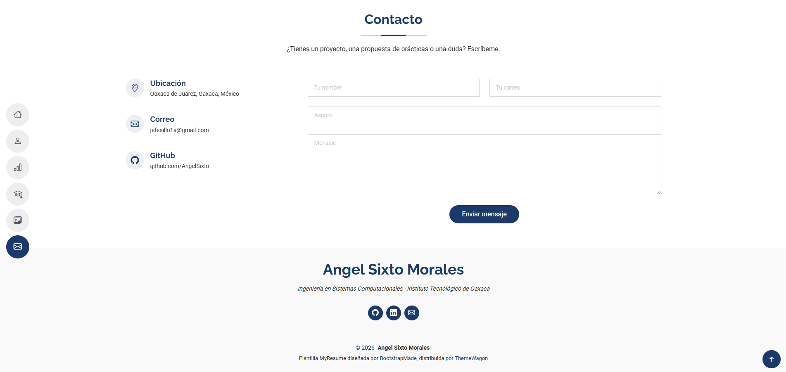

<div align="center">


# INSTITUTO TECNOLÓGICO DE OAXACA

## DEPARTAMENTO DE SISTEMAS Y COMPUTACIÓN

### INGENIERÍA EN SISTEMAS COMPUTACIONALES

### TEMA 2: HTML, XML Y CSS

### Act. 4: Portafolio Web con Bootstrap o Tailwind

| | |
|---|---|
| **Materia** | Programación Web |
| **Grupo** | 7SD |
| **Docente** | Ing. Adelina Martínez Nieto |
| **Presenta** | Sixto Morales Angel |
| **Fecha de entrega** | 30 de septiembre de 2026 |

</div>

---

# Portafolio Web – Sixto Morales Angel



Portafolio personal responsivo hecho con **HTML, CSS y JavaScript** y **Bootstrap 5.3** como base de estilos. Parte de la plantilla gratuita **MyResume**, de **BootstrapMade**, distribuida por **ThemeWagon**. En él presento quién soy, mis habilidades, mi formación, mis proyectos y un formulario de contacto. Está publicado en GitHub Pages.

🔗 **Ver en vivo:** https://angelsixto.github.io/Actividad4_Programacion-Web/

---

## Descripción del proyecto

| Elemento | Detalle |
|---|---|
| Framework CSS | **Bootstrap 5.3.3** por CDN (sin Tailwind, sin React/Vue) |
| Plantilla | **MyResume** de BootstrapMade (versión gratuita) |
| Descarga de la plantilla | https://bootstrapmade.com/free-html-bootstrap-template-my-resume/ |
| Repositorio (ThemeWagon) | https://github.com/themewagon/MyResume |
| Librerías extra (CDN) | Bootstrap Icons 1.11, AOS 2.3 (animaciones), Typed.js 2.1 (texto animado) |

### Menú y secciones

La plantilla tiene un **menú lateral de iconos circulares**. En computadora, al pasar el cursor por un icono se despliega su nombre; en celular se abre con un botón de hamburguesa. Además, el icono de la sección visible se resalta. Las secciones son:

1. **Inicio**: mi nombre, un texto animado que va cambiando ("estudiante de Ingeniería en Sistemas", "desarrollador web en formación"…), enlaces a GitHub, LinkedIn y correo, y un botón para ver los proyectos.
2. **Sobre mí**: foto de perfil, descripción personal y datos principales: carrera, escuela, ciudad, semestre, correo y disponibilidad para prácticas.
3. **Habilidades**: barras de progreso que se llenan al llegar a la sección (HTML5, CSS3/Bootstrap, JavaScript, Java, SQL, Git) y tarjetas con las tecnologías que quiero dominar (Python, Node.js, apps móviles, Figma).
4. **Formación**: línea de tiempo con un resumen, mi carrera en el Instituto Tecnológico de Oaxaca, la materia de Programación Web y cursos en línea.
5. **Proyectos**: galería de 6 proyectos con imagen, nombre, descripción y estado (Terminado, En desarrollo o Planeado). Al pasar el cursor aparece la información, y unos botones filtran por categoría (Web, Apps, Datos).
6. **Contacto**: mi ubicación, correo y GitHub, y un formulario (nombre, correo, asunto, mensaje) con validación.
7. **Pie de página**: nombre, carrera, redes sociales, año automático y créditos de la plantilla.

---

## Estructura del repositorio

```
├── README.md
├── index.html
├── css/
│   └── portafolio.css      ← secciones usadas de main.css de la plantilla + estilos propios
├── js/
│   └── portafolio.js       ← main.js de la plantilla simplificado + funciones propias
└── img/
    ├── perfil.jpg          ← foto de perfil
    ├── favicon.png
    ├── logo-ito.png        ← logo para la portada de este README
    ├── proyectos/          ← imágenes de los proyectos
    └── capturas/           ← capturas de pantalla de este README
```

---

## Proceso de creación (paso a paso)

1. **Elegir la plantilla.** En BootstrapMade revisé las plantillas gratuitas de portafolio y CV. Elegí **MyResume** porque usa Bootstrap 5.3, no depende de frameworks de JavaScript y su menú lateral de iconos le da un diseño diferente y limpio.
2. **Descargar y revisar.** Descargué el .zip. La plantilla trae `assets/css/main.css` (1458 líneas), `assets/js/main.js`, la carpeta `assets/vendor/` con 11 librerías y secciones de ejemplo (*Hero, About, Stats, Skills, Resume, Portfolio, Services, Testimonials, Contact*).
3. **Reorganizar la estructura.** Para cumplir con lo pedido, moví todo a `css/portafolio.css`, `js/portafolio.js` e `img/`. Eliminé la carpeta `vendor` y cargué las librerías necesarias desde un **CDN** (jsDelivr), así el repositorio queda más ligero.
4. **Reducir el CSS.** Quité de `main.css` los estilos de las secciones que no uso (*Stats, Services, Testimonials*, páginas de detalle, *preloader* y mensajes del formulario PHP). El archivo bajó de **1458 a unas 780 líneas** de la plantilla. Al final agregué unas 50 líneas propias marcadas como `ESTILOS PERSONALIZADOS`.
5. **Quitar secciones.** Eliminé *Stats* (contadores), *Services* y *Testimonials*, porque como estudiante todavía no tengo clientes ni testimonios.
6. **Español y datos personales.** Cambié el idioma a `lang="es"`, el título de la página y todos los textos de ejemplo (*Brandon Johnson*, *Lorem ipsum*…) por mi información y la del Instituto Tecnológico de Oaxaca.
7. **Nueva paleta de colores.** Cambié el color de acento de la plantilla (`--accent-color`) a **azul marino `#1b396a`** y agregué un **dorado `#c8a24a`** para las barras de habilidades y la etiqueta "Planeado". En el inicio reemplacé la foto de fondo por un degradado suave.
8. **Adaptar secciones.**
   - *About → Sobre mí*: cambié los datos (cumpleaños, teléfono, etc.) por carrera, escuela, semestre y correo.
   - *Skills → Habilidades*: puse mis tecnologías y agregué tarjetas de "Quiero dominar".
   - *Resume → Formación*: cambié "Experiencia profesional" por "Cursos y actividades".
   - *Portfolio → Proyectos*: puse 6 proyectos propios con imágenes nuevas y etiquetas de estado.
   - *Contact → Contacto*: quité el envío por PHP (GitHub Pages no ejecuta PHP) y lo sustituí por validación con JavaScript.
9. **JavaScript** (`js/portafolio.js`). Conservé de la plantilla el menú móvil, el botón "volver arriba", las animaciones AOS, el texto animado Typed.js y el resaltado del menú. Reemplacé librerías por código propio:
   - **Waypoints** → `IntersectionObserver` para llenar las barras de habilidades,
   - **Isotope** → filtro de proyectos con JavaScript simple,
   - **PHP Email Form** → validación del formulario con mensaje de confirmación,
   - además, año automático en el pie de página.
10. **Créditos.** Mantuve el crédito a BootstrapMade y ThemeWagon en el pie de página, como pide la licencia gratuita de la plantilla.
11. **Pruebas.** Revisé el sitio en computadora y en vista de celular.
12. **Publicación.** Subí el proyecto a un repositorio público y activé GitHub Pages (*Settings → Pages → Deploy from a branch → main / root*).

---

## Capturas de pantalla

**Inicio**


**Sobre mí**


**Habilidades**


**Formación**


**Proyectos**


**Contacto**



---

## Créditos

Plantilla base: [MyResume](https://bootstrapmade.com/free-html-bootstrap-template-my-resume/), diseñada por [BootstrapMade](https://bootstrapmade.com/) y distribuida por [ThemeWagon](https://themewagon.com/). Contenido y personalización: Sixto Morales Angel.
